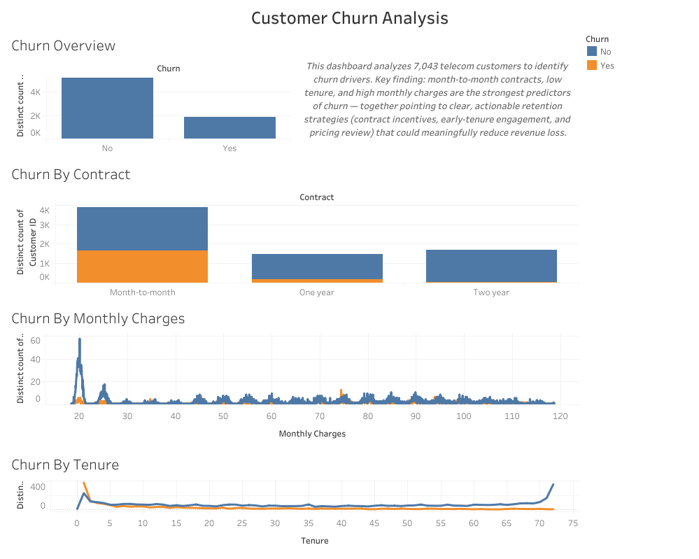

# Customer Churn Prediction & Analysis

Predicting customer churn for a telecom provider using exploratory data analysis and supervised machine learning — identifying which customers are most likely to leave and why.

## Overview

Customer churn directly impacts recurring revenue, and acquiring a new customer typically costs more than retaining an existing one. This project analyzes the Telco Customer Churn dataset to uncover the behavioral and account-level patterns behind churn, then builds classification models to predict it, and presents the findings in an interactive Tableau dashboard for stakeholders.

## Dataset

Source: Telco Customer Churn (WA_Fn-UseC_-Telco-Customer-Churn.csv)
Size: ~7,000 customer records, 21 features
Target variable: Churn (Yes/No)
Features: Contract type, tenure, monthly charges, total charges, internet/phone services, payment method, demographics

## Approach

### 1. Data Cleaning

Converted TotalCharges from string to numeric, identifying and removing rows with invalid entries
Removed non-predictive identifier columns (customerID)
Encoded the target variable and categorical features using one-hot encoding

### 2. Exploratory Data Analysis

Visualized overall churn distribution across the customer base
Analyzed churn by contract type — found month-to-month customers churn at a noticeably higher rate than customers on 1- or 2-year contracts
Examined tenure distribution — newer customers show higher churn risk
Examined monthly charges distribution — higher billing correlates with increased churn likelihood

### 3. Feature Engineering

One-hot encoded all categorical variables for model compatibility
Standardized numerical features for logistic regression using StandardScaler
Split data into training and test sets (80/20) with stratified sampling to preserve class balance

### 4. Modeling

Logistic Regression — baseline interpretable model
Random Forest Classifier (200 estimators) — captures non-linear relationships

### 5. Evaluation

Assessed both models using accuracy, precision, recall, F1-score, and confusion matrices
Extracted feature importances from the Random Forest model to identify the strongest churn drivers

## Key Findings

Contract type is one of the strongest predictors — month-to-month customers are significantly more likely to churn than those on longer-term contracts
Tenure matters — customers in their first few months are at the highest risk of leaving
Monthly charges show a positive relationship with churn — higher bills are associated with higher churn rates

These findings translate directly into business action: target retention efforts (discounts, contract incentives, proactive outreach) at new, month-to-month, high-bill customers before they churn.

## Interactive Dashboard

To make these findings accessible to non-technical stakeholders, the key insights were built into an interactive Tableau dashboard.



**[View the live interactive dashboard on Tableau Public](https://public.tableau.com/app/profile/urooj.fatima4549/viz/TelcoCustomerChurnAnalysis_17818316850600/CustomerChurnAnalysis)**

The dashboard includes:
- Overall churn rate across the customer base
- Churn breakdown by contract type
- Churn patterns by customer tenure
- Churn distribution by monthly charges

The Tableau workbook file (`.twbx`) is also included in this repo for anyone who wants to explore it directly in Tableau Desktop or Tableau Public.

## Tech Stack

Python · Pandas · NumPy · Scikit-learn · Matplotlib · Seaborn · Jupyter Notebook · Tableau Public

## Skills Demonstrated

Data cleaning and preprocessing (handling missing/invalid data, type conversion)
Exploratory data analysis and data visualization
Categorical encoding and feature scaling
Supervised machine learning (classification)
Model evaluation and interpretation
Building interactive dashboards for stakeholder-facing reporting
Translating technical results into business-relevant insights

## How to Run

```bash
pip install pandas numpy scikit-learn matplotlib seaborn
jupyter notebook customer_churn_analysis.ipynb
```

To explore the dashboard, either click the live link above or open `CustomerChurnAnalysis.twbx` in [Tableau Public](https://public.tableau.com/) (free).

## Future Improvements

Hyperparameter tuning (GridSearchCV) to improve model performance
Testing additional models (XGBoost, Gradient Boosting)
Addressing class imbalance with SMOTE or class weighting
